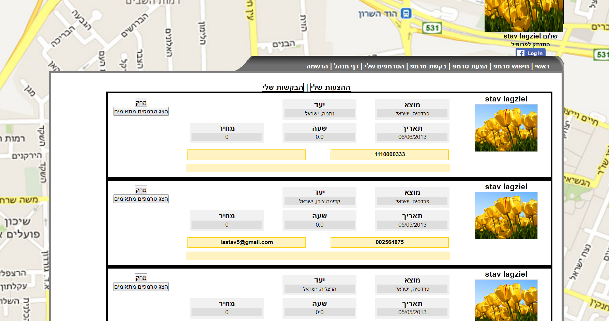

# Tremps

A web based system for sharing car rides. A user can offer or request a ride, after which they are matched accordingly with other offers/requests.  
Offering a ride requires the user to choose a route from their origin to their destination (this is done via google maps). After choosing, the route coordinates will be collected and saved in the database.  
Requesting a ride requires the user to fill in their origin and destination.  
Matches are decided upon finding an offer whose origin and destination each is at most 1km in distance from one of the request's route's coordinates. Put simply, an offer and a request will be matched if the request's route is close enough to the offer's origin destination points.

Note:
This project was built in 2013 and as such the Facebook and Google Maps API's commands used in it are by now deprecated.

